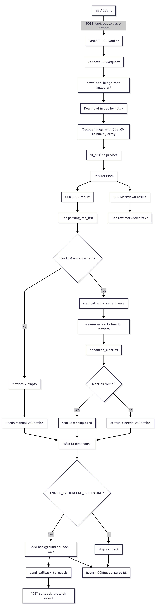
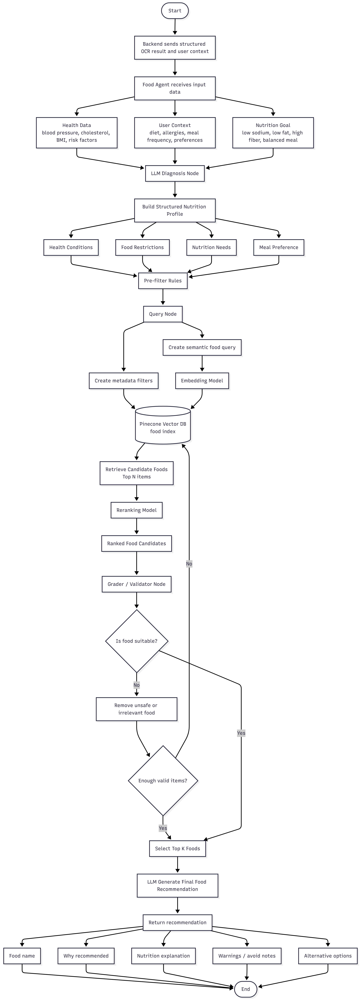
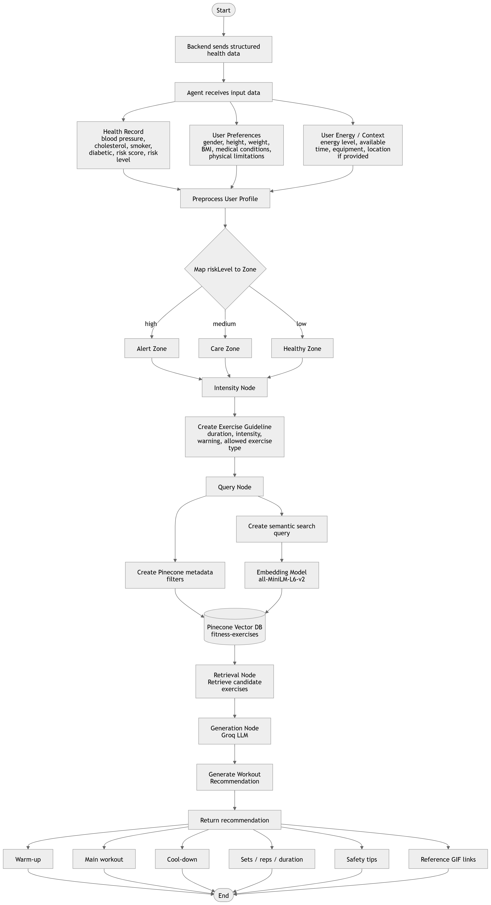

# Heartify AI Backend

Backend AI service cho hệ thống Heartify. Repo này hiện quản lý ba nhóm năng lực AI chính:

- OCR medical report: đọc ảnh/tài liệu y tế và trích xuất chỉ số sức khỏe.
- Food recommendation RAG: tạo hồ sơ dinh dưỡng và truy vấn món ăn phù hợp từ Pinecone.
- Exercise recommendation RAG: tạo guideline tập luyện theo rủi ro sức khỏe, cường độ và ngữ cảnh người dùng.

## Cấu Trúc Thư Mục

```text
heartify-AI/
├── fastapi_ai/
│   └── app/
│       ├── api/
│       │   └── endpoints/
│       │       └── ocr_vl.py              # OCR REST endpoint
│       ├── models/
│       │   ├── requests.py                # Request schemas
│       │   └── responses.py               # Response schemas
│       ├── services/
│       │   ├── ocr/
│       │   │   ├── vl_engine.py           # PaddleOCR-VL runtime engine
│       │   │   └── paddleocr_vl_engine.py # Legacy/experimental OCR wrapper
│       │   ├── llm/
│       │   │   └── enhancer.py            # Gemini metric extraction
│       │   ├── food/
│       │   │   ├── pinecone_pipeline.py   # Build food vector index
│       │   │   ├── query_db.py            # Query food index
│       │   │   └── requirements_pinecone.txt
│       │   └── fitness/
│       │       ├── intensity_classifier.py # Rule-based exercise intensity
│       │       └── pinecone_fitness.py     # Build fitness vector index
│       ├── utils/
│       │   ├── callbacks.py               # Callback to NestJS/BE
│       │   └── image_utils.py             # Download/decode image
│       ├── config.py                      # Environment settings
│       └── main.py                        # FastAPI app entrypoint
├── docs/
│   ├── diagrams/
│   │   ├── ocr-metrics-validation.png
│   │   ├── structured-nutrition.png
│   │   └── exercise-agent.png
│   └── samples/
│       └── image1.png
├── notebooks/
│   ├── AgentExercise.ipynb
│   └── Food_RAG.ipynb
├── tests/
│   └── manual/
│       ├── test_api.py                    # Manual API smoke test
│       ├── test_predict.py                # Direct OCR engine smoke test
│       └── test_pinecone_fitness.py
├── Dockerfile
├── docker-compose.yml
├── Makefile
└── requirements.txt
```

## Tổng Quan Kiến Trúc

FastAPI là service AI độc lập. Backend chính hoặc client gửi request sang FastAPI, FastAPI xử lý OCR/RAG/LLM, sau đó trả response trực tiếp và có thể gửi callback bất đồng bộ về NestJS.

Các sơ đồ chi tiết của từng module nằm trong các phần OCR, Food Recommendation và Exercise Recommendation bên dưới.

## Module 1: OCR Medical Metrics

Mục tiêu: nhận URL ảnh báo cáo y tế, chạy PaddleOCR-VL, lấy text/table block, dùng LLM để chuẩn hóa thành chỉ số sức khỏe có cấu trúc.

File chính:

- `fastapi_ai/app/api/endpoints/ocr_vl.py`
- `fastapi_ai/app/services/ocr/vl_engine.py`
- `fastapi_ai/app/services/llm/enhancer.py`
- `fastapi_ai/app/utils/image_utils.py`
- `fastapi_ai/app/utils/callbacks.py`

### OCR Flow



### OCR API Contract

Endpoint:

```http
POST /api/ocr/extract-metrics
```

Request:

```json
{
  "image_id": "medical-report-001",
  "user_id": "user-001",
  "image_url": "https://example.com/report.png",
  "callback_url": "https://backend.example.com/api/webhooks/ocr-complete",
  "use_layout_detection": true,
  "use_chart_recognition": false,
  "use_llm_enhancement": true
}
```

Response:

```json
{
  "image_id": "medical-report-001",
  "status": "completed",
  "extracted_metrics": [
    {
      "metric_name": "Glucose",
      "value": 95,
      "unit": "mg/dL",
      "confidence_score": 0.9,
      "reference_range": "70-99",
      "is_abnormal": false,
      "source_text": "Glucose: 95 mg/dL"
    }
  ],
  "raw_ocr_text": "OCR markdown text",
  "processing_time_seconds": 3.42,
  "needs_human_validation": false,
  "validation_notes": [],
  "preprocessing_applied": false,
  "ocr_engine": "paddleocr_vl_native",
  "llm_usage": {
    "input_tokens": 1200,
    "output_tokens": 200
  },
  "metadata": {
    "backend": "native",
    "layout_detection": true,
    "chart_recognition": false,
    "blocks_parsed": 8,
    "timing": {
      "download": 0.21,
      "vl_prediction": 2.84,
      "llm_enhancement": 0.37
    }
  }
}
```

Callback payload gửi về NestJS:

```json
{
  "image_id": "medical-report-001",
  "user_id": "user-001",
  "result": {
    "image_id": "medical-report-001",
    "status": "completed",
    "extracted_metrics": []
  }
}
```

## Module 2: Food Recommendation RAG

Mục tiêu: dùng structured OCR result và user context để tạo hồ sơ dinh dưỡng, lọc trước bằng rule, query Pinecone food index, rerank và sinh gợi ý món ăn.

Hiện trạng code:

- Pipeline build index: `fastapi_ai/app/services/food/pinecone_pipeline.py`
- Query thử index: `fastapi_ai/app/services/food/query_db.py`
- Notebook prototype: `notebooks/Food_RAG.ipynb`

Food index đang dùng:

- Pinecone index: `food-nutrition-recipes`
- Embedding model: `sentence-transformers/all-MiniLM-L6-v2`
- Dimension: `384`
- Dataset: `datahiveai/recipes-with-nutrition`

### Food Agent Flow



Expected output cho BE:

```json
{
  "recommendations": [
    {
      "food_name": "Oatmeal with berries",
      "why_recommended": "High fiber and suitable for cholesterol control",
      "nutrition_explanation": "Contains soluble fiber and moderate calories",
      "warnings": ["Avoid added sugar"],
      "alternatives": ["Greek yogurt with nuts"]
    }
  ]
}
```

## Module 3: Exercise Recommendation RAG

Mục tiêu: tạo workout recommendation dựa trên risk level, health record, user preference, energy/context và dữ liệu bài tập trong Pinecone.

Hiện trạng code:

- Pipeline build index: `fastapi_ai/app/services/fitness/pinecone_fitness.py`
- Intensity classifier: `fastapi_ai/app/services/fitness/intensity_classifier.py`
- Notebook prototype: `notebooks/AgentExercise.ipynb`

Fitness index đang dùng:

- Pinecone index: `fitness-exercises`
- Embedding model: `sentence-transformers/all-MiniLM-L6-v2`
- Dimension: `384`
- Metadata chính: body part, target muscle, equipment, intensity, gif URL.

### Exercise Agent Flow



Expected output cho BE:

```json
{
  "zone": "care",
  "max_intensity": 3,
  "workout": {
    "warm_up": [],
    "main_workout": [],
    "cool_down": [],
    "sets_reps_duration": "20 minutes total",
    "safety_tips": ["Stop if chest pain or dizziness occurs"],
    "reference_gif_links": []
  }
}
```

## Environment Variables

Tạo file `.env` ở root khi chạy bằng Docker compose.

```env
# LLM
GEMINI_API_KEY=
GEMINI_MODEL=gemini-1.5-flash
GEMINI_TEMPERATURE=0.2
GEMINI_MAX_TOKENS=1024

# Pinecone
PINECONE_API_KEY=

# NestJS callback
NESTJS_CALLBACK_URL=http://host.docker.internal:3000

# OCR backend
VL_BACKEND=native
VL_SERVER_URL=
VL_API_KEY=
VL_MAX_CONCURRENCY=4
VL_MODEL_NAME=PaddleOCR-VL-0.9B
VL_MODEL_DIR=

# OCR inference
USE_LAYOUT_DETECTION=true
USE_CHART_RECOGNITION=false
USE_LLM_ENHANCEMENT=true
ENABLE_BACKGROUND_PROCESSING=true
DEVICE=cpu
```

## Cách Chạy

Chạy bằng Docker:

```bash
make build
make up
```

API docs:

```text
http://localhost:8080/docs
```

Health check:

```bash
make health
```

Manual API smoke test:

```bash
make test
```

Override URL khi test:

```bash
HEARTIFY_AI_API_URL=http://localhost:8080 HEARTIFY_TEST_IMAGE_URL=http://localhost:9000/image1.png python tests/manual/test_api.py
```

PowerShell:

```powershell
$env:HEARTIFY_AI_API_URL="http://localhost:8080"
$env:HEARTIFY_TEST_IMAGE_URL="http://localhost:9000/image1.png"
python tests/manual/test_api.py
```

Chạy trực tiếp OCR engine:

```bash
make test-ocr-direct
```

## Tích Hợp Với Backend Chính

Backend chính nên coi FastAPI AI service là service xử lý bất đồng bộ hoặc bán đồng bộ.

Luồng khuyến nghị:

1. Backend upload ảnh/tài liệu lên storage và lấy public/internal `image_url`.
2. Backend gọi `POST /api/ocr/extract-metrics`.
3. FastAPI trả response ngay sau khi xử lý xong OCR.
4. Nếu có `callback_url` hoặc `NESTJS_CALLBACK_URL`, FastAPI gửi thêm webhook kết quả.
5. Backend lưu `extracted_metrics`, `raw_ocr_text`, `status`, `needs_human_validation`.
6. Nếu `status = needs_validation`, chuyển sang màn hình review thủ công.

## Ghi Chú Kỹ Thuật

- OCR runtime hiện load `PaddleOCRVL` khi import `vl_engine`, nên thời gian khởi động có thể lâu.
- `paddleocr_vl_engine.py` là wrapper thử nghiệm cũ, chưa phải flow chính.
- Food/Fitness hiện chủ yếu là pipeline và prototype, chưa expose endpoint FastAPI chính thức.
- Khi production hóa Food/Fitness, nên thêm router riêng:
  - `POST /api/food/recommend`
  - `POST /api/fitness/recommend`
- Nên chuẩn hóa response của Food/Fitness thành Pydantic models giống OCR.
- Các notebook đã được tách vào `notebooks/`; code runtime nên nằm trong `fastapi_ai/app`.

## Hình Sơ Đồ

- OCR validation: `docs/diagrams/ocr-metrics-validation.png`
- Structured nutrition: `docs/diagrams/structured-nutrition.png`
- Exercise agent: `docs/diagrams/exercise-agent.png`
- Sample OCR image: `docs/samples/image1.png`
